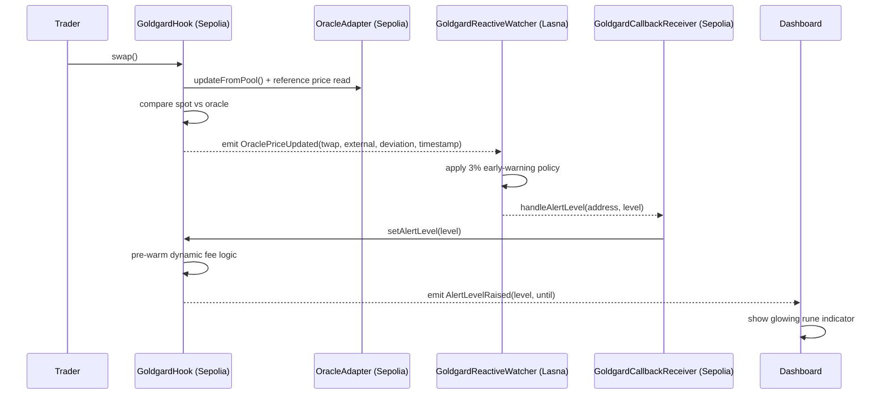
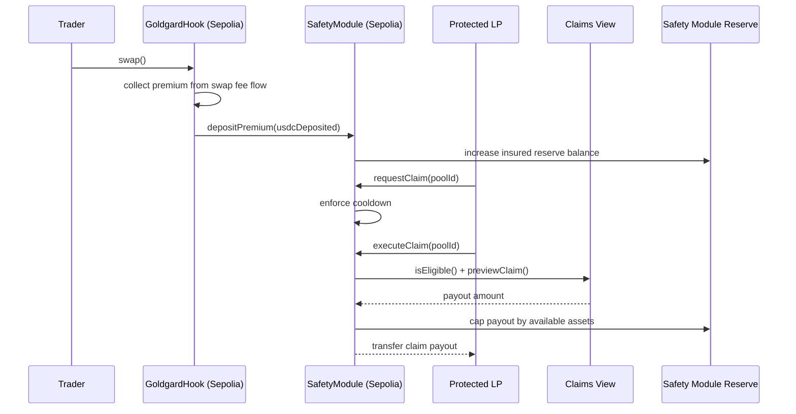

# Goldgard Hookathon — UHI9 (Yield‑Protected AMM)

Goldgard is a Uniswap v4 hook demo that protects LST LP yield: **oracle‑aware dynamic fees + circuit breaking + post‑swap delta rebalancing** funded by a **0.02% insurance premium** flowing into an **ERC‑4626 Safety Module**.

## How I Explain Goldgard

I think about Goldgard as a protection layer wrapped around LP activity. The product is meant to feel simple from the outside: LPs provide liquidity, traders keep trading, and the system quietly becomes more defensive when price risk starts to build.

When a swap comes in, my hook on Sepolia checks whether the pool price is drifting away from a safer reference price. That reference price comes from the `OracleAdapter`, which prefers a fresh Chainlink feed and can safely fall back to fresh pool activity when Chainlink is stale. If the market looks healthy, swaps move through the normal fee curve. If deviation starts widening, the hook raises fees dynamically. If the deviation gets too large, the circuit breaker pauses the pool before damage turns into a full loss event.

The Reactive Network is what makes Goldgard proactive instead of only reactive. The hook still has its own local fee trigger and circuit breaker, but the `GoldgardReactiveWatcher` on Lasna listens to `OraclePriceUpdated` events emitted on Sepolia and reacts earlier. When TWAP vs Chainlink divergence crosses the early-warning threshold, it sends a callback back to Sepolia through `GoldgardCallbackReceiver`. That receiver is my trust boundary: it validates the callback path and then tells the hook to raise an alert level.

That alert level matters because it pre-warms the defensive fee logic before the next swap is priced. So even before the hook would have independently hit its own higher threshold, the system is already leaning defensive. The hook records the alert, emits `AlertLevelRaised`, and the dashboard turns that state into the visible "rune" signal that conditions are getting dangerous.

So the full product loop is:

- swaps feed fresh pool state into the oracle path
- the hook emits divergence telemetry on Sepolia
- the Reactive watcher on Lasna interprets that telemetry earlier than the hook's own hard protections
- the callback receiver forwards a bounded action back into the hook
- the hook raises the alert state, pre-warms fees, and exposes the signal to the UI

That is the core Goldgard idea: price risk is watched locally, reinforced cross-chain, and surfaced clearly enough that both the protocol and the user can react before a bad move becomes a loss event.

The first diagram shows how the alerting side works across Sepolia and Lasna.

### Cross-Chain Alert Flow



The second diagram shows the insurance side: how swap activity funds the reserve, and how claims turn that reserve back into protection for LPs.

### Insurance Reserve Flow



## Repo Layout

```
goldgard-hookathon/
├── contracts/   (Foundry + Uniswap v4-core/v4-periphery)
└── frontend/    (Next.js 15 + TypeScript + Tailwind + RainbowKit)
```

## UHI9 Mapping

- Delta‑neutral hook: `afterSwap` computes swap deltas and rebalances against `HedgeReserve` in the same transaction.
- Yield protection: `SafetyModule` (ERC‑4626) accumulates swap premiums; claims gated by eligibility + cooldown.
- Fee smoothing & safety: `beforeSwap` does oracle deviation checks, dynamic LP fee override, and circuit breaker.

## Quickstart (Local / Anvil)

### Prereqs

- Node.js 20+ and pnpm
- Foundry (forge/cast/anvil)

### 1) Contracts: deploy the demo pool + hook

```bash
cd contracts
anvil
```

In a second terminal:

```bash
cd contracts
forge script script/DeployDemo.s.sol:DeployDemo \
  --rpc-url http://127.0.0.1:8545 \
  --private-key <ANVIL_PRIVATE_KEY> \
  --broadcast
```

This writes a fresh frontend config to `frontend/app/config/demoConfig.local.json`.

Optional live-safe oracle envs for `DeployDemo`:

- `CHAINLINK_AGGREGATOR`: use a real Chainlink feed instead of deploying the mock aggregator
- `CHAINLINK_AGGREGATOR_DECIMALS`: feed decimals, default `8`
- `CHAINLINK_MAX_STALE_SECONDS`: freshness window for Chainlink, default `3600`
- `POOL_MAX_STALE_SECONDS`: freshness window for pool-derived TWAP fallback, default `3600`

### 2) Frontend: run the dashboard

```bash
cd frontend
pnpm install
pnpm dev
```

Set `NEXT_PUBLIC_WALLETCONNECT_PROJECT_ID` in `frontend/.env.local` to enable WalletConnect.

Open:

- `/` landing
- `/dashboard` dashboard
- `/demo` demo console (mint → approve → execute)

### 3) Price swing simulation (script + UI)

Script (recommended for deterministic runs):

```bash
cd contracts
forge script script/SimulatePriceSwing.s.sol:SimulatePriceSwing \
  --rpc-url http://127.0.0.1:8545 \
  --private-key <ANVIL_PRIVATE_KEY> \
  --broadcast
```

UI trigger (local only):

- set `DEMO_RPC_URL` and `DEMO_PRIVATE_KEY` in `frontend/.env.local`
- click “Run 10% Swing (Local)” on `/dashboard`

## Insurance Simulation

The frontend workspace now includes a contract-aligned stochastic simulation for:

- insured loss event generation,
- premium collection and adequacy analysis,
- reactive contract activation and post-trigger outcomes.

Run the default scenario:

```bash
cd frontend
pnpm simulate:insurance
```

Run with the sample configuration and persist reports:

```bash
cd frontend
pnpm simulate:insurance -- \
  --config scripts/insurance-simulation.sample.json \
  --report-json reports/insurance-simulation.json \
  --report-md reports/insurance-simulation.md \
  --events-json reports/insurance-events.json
```

Validation checks:

```bash
cd frontend
pnpm test:insurance-sim
```

Testnet rerun capture for on-chain simulation receipts:

```bash
cd frontend
pnpm simulate:testnet:rerun -- --config scripts/testnet-simulation-cases.sample.json
```

This command requires `SEPOLIA_RPC_URL` plus `SEPOLIA_PRIVATE_KEY` (or `PRIVATE_KEY`).

## Sepolia Deployment

Use the same Foundry scripts with a Sepolia RPC URL and funded private key:

```bash
cd contracts
forge script script/DeployDemo.s.sol:DeployDemo \
  --rpc-url <SEPOLIA_RPC_URL> \
  --private-key <SEPOLIA_PRIVATE_KEY> \
  --broadcast \
  --verify \
  --etherscan-api-key <ETHERSCAN_KEY>
```

<br />

## Post‑Hackathon Roadmap

- Head & Branch: modular hedging policies per pool archetype
- synBNC CDP: collateralized delta‑neutral borrowing against LST yields
- BTC & Stablecoin Yield Vault: cross‑margin hedging and risk‑tranching for Stablecoin & BTC‑denominated yield
