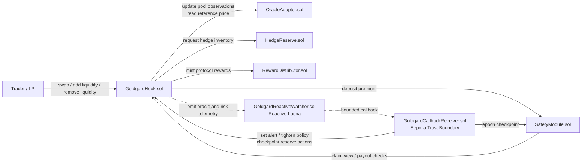

## Goldgard (Foundry)

This folder contains the Goldgard onchain system: the Uniswap v4 hook, the insurance reserve, the hedging inventory, the oracle path, and the Reactive Network integration that pre-warms defense before the next swap.

## How The Contracts Fit Together

Goldgard is built around a simple product loop:

1. `GoldgardHook.sol` prices risk at swap time and decides whether the pool should charge a higher fee or stop trading.
2. `OracleAdapter.sol` supplies the reference price, preferring fresh Chainlink and falling back to fresh pool TWAP when needed.
3. `SafetyModule.sol` receives swap-funded premiums and pays LP claims after cooldown and eligibility checks.
4. `HedgeReserve.sol` holds reserve inventory used to offset exposure created by swaps.
5. `GoldgardReactiveWatcher.sol` on Reactive Lasna watches Sepolia telemetry and sends bounded callbacks earlier than the hook's own hard protections.
6. `GoldgardCallbackReceiver.sol` is the Sepolia trust boundary that validates Reactive callbacks before forwarding narrow actions into the hook or safety module.

## Contract Map

### Core Product Contracts

- `GoldgardHook.sol`
  - Main Uniswap v4 hook and the center of the protocol.
  - Uses `beforeSwap` to read oracle state, compute deviation, raise dynamic fees, and trigger the circuit breaker.
  - Uses `afterSwap` to collect the insurance premium, route assets into the safety module, and track reserve-backed rebalancing demand.
  - Tracks LP position enrollment, in-range time, and claim previews for insurance eligibility.
- `OracleAdapter.sol`
  - Goldgard's reference price layer.
  - Stores pool-side observations to build a TWAP history.
  - Reads a Chainlink-style feed when configured and fresh.
  - Falls back to fresh pool activity when the external feed is stale, which keeps the system live-safe instead of freezing on feed outages.
- `SafetyModule.sol`
  - ERC-4626 reserve vault for insurance premiums.
  - Accepts premium deposits from the hook.
  - Enforces claim request cooldowns and pays claims only when the configured claims view says the LP is eligible.
  - Supports a delayed claims-view migration so claim logic can be upgraded behind a timelock.
- `HedgeReserve.sol`
  - Reserve inventory that helps offset swap-created imbalance.
  - Converts between token inventories using the strict oracle reference price.
  - Rejects conversions when spot and oracle are too far apart, which protects reserve assets during stale or manipulated conditions.
- `RewardDistributor.sol`
  - Minimal ERC-6909 reward token minter.
  - Only the hook is allowed to mint, so reward issuance stays tied to protocol activity.

### Reactive Network Contracts

- `GoldgardReactiveWatcher.sol`
  - Runs on Reactive Lasna as the cross-chain policy engine.
  - Subscribes to Sepolia events such as oracle divergence, reserve depletion, and claim outcomes.
  - Decides when Goldgard should tighten thresholds, raise alert levels, or adjust premium policy before the local hook would necessarily do so on its own.
- `GoldgardCallbackReceiver.sol`
  - Receives Sepolia callbacks coming through the Reactive callback proxy.
  - Validates both the trusted proxy and, when configured, the exact watcher contract that originated the callback payload.
  - Forwards only bounded, narrow control actions into the hook or safety module.
- `ReactiveSubscribeProbe.sol`
  - Debug helper for Reactive deployment troubleshooting.
  - Lets you test a single subscription tuple and emit the exact source/topic values used.
  - Exists to isolate Reactive subscription issues without involving the full watcher policy logic.

### Shared Interfaces And Libraries

- `interfaces/IChainlinkAggregatorV3.sol`
  - Minimal feed interface used by `OracleAdapter.sol`.
- `libraries/BaseHook.sol`
  - Small base contract that pins hook entrypoints to the pool manager and reverts unimplemented callbacks.
- `libraries/Transient.sol`
  - EIP-1153 helpers used to pass rebalance state through a single transaction.
- `mocks/MockAggregatorV3.sol`
  - Local and test-only feed used when a live Chainlink feed is not wired in.

## Typical Runtime Flow

### 1. Swap Protection

- A trader hits the pool and `GoldgardHook.beforeSwap()` runs.
- The hook asks `OracleAdapter` for the best available reference price.
- If deviation is moderate, the hook increases LP fees dynamically.
- If deviation crosses the breaker threshold, the hook pauses swaps for the configured cooldown window.

### 2. Premium Funding

- After a swap, `GoldgardHook.afterSwap()` computes the premium slice from fee flow.
- Premium is normalized into the reserve asset and deposited into `SafetyModule`.
- A portion of flow is also tracked for later reserve-backed rebalancing.

### 3. LP Protection

- LP positions are enrolled and tracked as liquidity is added and removed.
- `SafetyModule` waits for a claim request plus cooldown.
- At execution time it asks the hook's claims view whether the LP is eligible and what payout is allowed.
- Payouts are capped by both policy settings and available reserve assets.

### 4. Reactive Early Warning

- Sepolia oracle telemetry is emitted during hook activity.
- `GoldgardReactiveWatcher` on Lasna can react earlier than the hook's own higher swap-time thresholds.
- The watcher sends a bounded callback to `GoldgardCallbackReceiver`.
- The receiver validates the trust boundary and forwards the action into `GoldgardHook.setAlertLevel()` or other authorized surfaces.
- The hook pre-warms its defensive fee curve so the next swap is priced more defensively.

## Contract Interaction Diagram



## Developer Notes

- The most important contracts to read first are `GoldgardHook.sol`, `OracleAdapter.sol`, `SafetyModule.sol`, and `GoldgardReactiveWatcher.sol`.
- The system is intentionally split so pricing, reserve custody, Reactive callbacks, and claims execution each have their own trust boundary.

### Build & Test

```bash
forge build
forge test
```

### Local Demo (Anvil)

Terminal A:

```bash
anvil
```

Terminal B:

```bash
forge script script/DeployDemo.s.sol:DeployDemo \
  --rpc-url http://127.0.0.1:8545 \
  --private-key 0xac0974bec39a17e36ba4a6b4d238ff944bacb478cbed5efcae784d7bf4f2ff80 \
  --broadcast
```

### 10% Swing Simulation

```bash
forge script script/SimulatePriceSwing.s.sol:SimulatePriceSwing \
  --rpc-url http://127.0.0.1:8545 \
  --private-key 0xac0974bec39a17e36ba4a6b4d238ff944bacb478cbed5efcae784d7bf4f2ff80 \
  --broadcast
```

